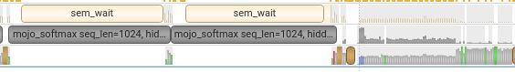

# Day 010 (2025/6/28)
- Added a simple benchmark script for softmax
- Observed poor performance on my softmax kernel and tried to profile it with nsys

## Benchmark result
Referred to [flashinfer benchmarks](https://github.com/flashinfer-ai/flashinfer/tree/main/benchmarks), leveraging `triton.testing.do_bench()` to measure speed (lantency, throughput) and the improvement against torch's implementation
<details> <summary> Tested on 3080 </summary>

```bash
seq_len=1, hidden_size=128, dtype=torch.float32
Latency:
torch:   5.120us
Mojo : 53463.041us
Throughput:
torch:   0.200GB/s
Mojo :   0.000GB/s
Mojo Speedup: 0.000x
----------
seq_len=1, hidden_size=512, dtype=torch.float32
Latency:
torch:   6.144us
Mojo : 32926.752us
Throughput:
torch:   0.667GB/s
Mojo :   0.000GB/s
Mojo Speedup: 0.000x
----------
seq_len=1, hidden_size=1024, dtype=torch.float32
Latency:
torch:   7.072us
Mojo : 32618.752us
Throughput:
torch:   1.158GB/s
Mojo :   0.000GB/s
Mojo Speedup: 0.000x
----------
seq_len=1, hidden_size=4096, dtype=torch.float32
Latency:
torch:   6.144us
Mojo : 35182.592us
Throughput:
torch:   5.333GB/s
Mojo :   0.001GB/s
Mojo Speedup: 0.000x
----------
====================
seq_len=16, hidden_size=128, dtype=torch.float32
Latency:
torch:   5.120us
Mojo : 50290.687us
Throughput:
torch:   3.200GB/s
Mojo :   0.000GB/s
Mojo Speedup: 0.000x
----------
seq_len=16, hidden_size=512, dtype=torch.float32
Latency:
torch:   5.120us
Mojo : 53228.097us
Throughput:
torch:  12.800GB/s
Mojo :   0.001GB/s
Mojo Speedup: 0.000x
----------
seq_len=16, hidden_size=1024, dtype=torch.float32
Latency:
torch:   7.168us
Mojo : 33359.871us
Throughput:
torch:  18.286GB/s
Mojo :   0.004GB/s
Mojo Speedup: 0.000x
----------
seq_len=16, hidden_size=4096, dtype=torch.float32
Latency:
torch:   6.144us
Mojo : 34372.608us
Throughput:
torch:  85.333GB/s
Mojo :   0.015GB/s
Mojo Speedup: 0.000x
----------
====================
seq_len=128, hidden_size=128, dtype=torch.float32
Latency:
torch:   5.120us
Mojo : 52217.855us
Throughput:
torch:  25.600GB/s
Mojo :   0.003GB/s
Mojo Speedup: 0.000x
----------
seq_len=128, hidden_size=512, dtype=torch.float32
Latency:
torch:   6.144us
Mojo : 53814.783us
Throughput:
torch:  85.333GB/s
Mojo :   0.010GB/s
Mojo Speedup: 0.000x
----------
seq_len=128, hidden_size=1024, dtype=torch.float32
Latency:
torch:   8.192us
Mojo : 33394.688us
Throughput:
torch: 128.000GB/s
Mojo :   0.031GB/s
Mojo Speedup: 0.000x
----------
seq_len=128, hidden_size=4096, dtype=torch.float32
Latency:
torch:  12.288us
Mojo : 36562.624us
Throughput:
torch: 341.333GB/s
Mojo :   0.115GB/s
Mojo Speedup: 0.000x
----------
====================
seq_len=1024, hidden_size=128, dtype=torch.float32
Latency:
torch:   6.144us
Mojo : 50316.927us
Throughput:
torch: 170.667GB/s
Mojo :   0.021GB/s
Mojo Speedup: 0.000x
----------
seq_len=1024, hidden_size=512, dtype=torch.float32
Latency:
torch:  11.200us
Mojo : 55173.727us
Throughput:
torch: 374.491GB/s
Mojo :   0.076GB/s
Mojo Speedup: 0.000x
----------
seq_len=1024, hidden_size=1024, dtype=torch.float32
Latency:
torch:  16.384us
Mojo : 32956.417us
Throughput:
torch: 512.000GB/s
Mojo :   0.255GB/s
Mojo Speedup: 0.000x
----------
seq_len=1024, hidden_size=4096, dtype=torch.float32
Latency:
torch:  53.248us
Mojo : 33744.896us
Throughput:
torch: 630.154GB/s
Mojo :   0.994GB/s
Mojo Speedup: 0.002x
----------
====================
```

</details>

I knew it would be bad but didn't expect it would be SO BAD. Something must be wrong.

## Profile with Nsight system
I decided to profile benchmark runtime and see what's going on.

- Added `torch.cuda.nvtx.range()` for readiblity in nsys-ui
- nsys command:
```bash
nsys profile -o report --force-ovewrite=true python benchmark/ops/bench_softmax.py
```
- `nsys-ui` to visualize it
<div>

</div>

(Left: Custom mojo softmax, Right: torch's softmax)

We can see that we have super large overhead in our mojo softmax. Most of the time wasn't spent on the gpu. 

## Todo
- Figure out what causes the overhead
    - Try torch.profiler to see how torch handles mojo ops under the hood
    - Try Nsight compute to measure kernels only